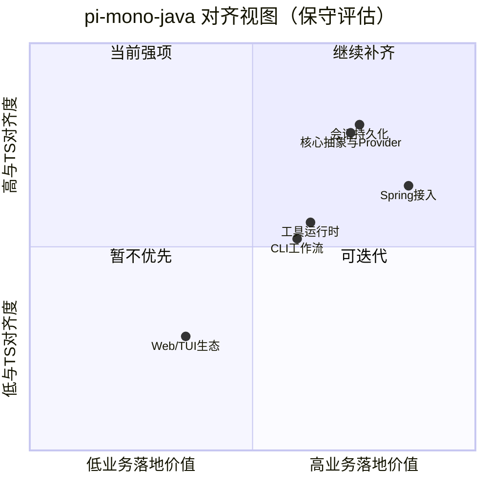

# 【B站技术稿】Java 版 pi-mono 到底能不能打？一条主链路 + 一组数据说清楚

> 适合发布平台：Bilibili（视频文案 + 图文稿）

## 视频标题建议

- 《Java 团队怎么低成本接入 Agent？pi-mono-java 实测》
- 《不是替代 TS：Java 版 pi-mono 的真实边界和收益》

## 开场 30 秒（口播）

很多 Java 团队想做 Agent，但总卡在两件事：
一是参考实现在 TS，二是缺少可快速回归的工程链路。
这次我用 `pi-mono-java` 做了完整实测：
它是否已经能用于 Java/Spring 业务？和 TS 版到底差多少？

## 核心结论（先给结论）

1. 对 Java/Spring 落地来说：**可用**。
2. 对 TS 版全量生态来说：**部分对齐，非全面对齐**。
3. 最大价值：把“能跑”升级成“可验证、可回归、可演进”。

## 数据面板（可上屏）

### 冒烟基准（2026-03-21）

| Step | Status | Duration |
|---|---:|---:|
| Compile | PASS | 2s |
| Session Unit Test | PASS | 2s |
| Spring Example Tests | PASS | 19s |
| CLI Smoke | PASS | 2s |

- 合计约 **25s**。
- 适合作为每次改动后的快速门禁。

### 测试与结构

- `@Test` 方法约 **17 个**。
- 主模块：`pi-core/pi-llm/pi-session/pi-tools/pi-cli/pi-starter`
- 工具：`read/write/edit/bash/find/grep/ls`

## 对齐图（建议做成视频中段）



> 说明：该图是基于仓库现状的工程判断，不是官方评分。

## 示例片段（可直接口播 + 贴终端）

```bash
mvn clean compile
mvn test
./scripts/benchmark_smoke.sh
mvn -f spring-test-example/pom.xml spring-boot:run
```

观察点：
- `spring-boot:run` 输出 `所有Spring集成测试通过！`
- Benchmark 报告四步均 PASS

## 截图与分镜占位

- [镜头1 / 截图占位] 仓库结构与模块图
- [镜头2 / 截图占位] benchmark 报告（PASS + 时延）
- [镜头3 / 截图占位] Spring 启动日志关键行
- [镜头4 / 截图占位] CLI help 与会话创建
- [镜头5 / 截图占位] 能力对齐表（核心/会话/工具/CLI/UI）

## 适合推荐给谁

- Java/Spring 业务系统负责人
- 想做 Agent、但不想先重建 TS 技术栈的团队
- 自研 Agent 平台，需要轻量参考实现的人

## 克制收尾（建议原文照读）

`pi-mono-java` 目前最像“Java 落地基线”，不是“TS 版完整镜像”。
如果你要的是尽快打通可验证主链路，它已经有价值；
如果你要的是完整体验生态，仍建议关注 TS upstream 的迭代。

## 参考链接

- 本项目仓库（Java）：`README.md` / `docs/capability-comparison.md`
- upstream（TS）：https://github.com/badlogic/pi-mono

