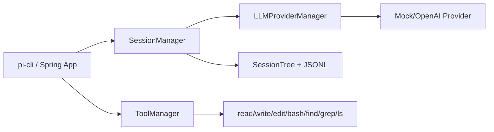

# 从 TypeScript 到 Java：我们为什么做 `pi-mono-java`，它到底能解决什么问题？

> 适合发布平台：博客园（技术长文）
> 
> 更新时间：2026-03-21

## 先说痛点（不是“技术情怀”，是业务现实）

很多团队的业务系统是 Java/Spring，想引入 Agent 能力时，第一步就卡住：

1. 参考实现大多是 TypeScript，团队主力读不动或接不住。
2. 概念能看懂，但落地到 Spring Bean 注入、配置管理、会话持久化时没有现成样板。
3. “先上再说”导致验证链路长：能跑、可测、可回归、可追溯做不全。

`pi-mono-java` 的目标很克制：
不是“替代 TS 生态”，而是给 Java 团队一个可以直接接业务的参考实现与起步底座。

## 这个项目当前完成度如何？

我把能力拆成 6 个一级域，给出保守判断（不是营销分）：

| 一级能力 | 当前状态 | 判断 |
|---|---|---|
| 核心模型与 Provider 抽象 | `pi-core` + `pi-llm` 已可用 | 高 |
| 会话树与持久化 | `pi-session`（JSONL）已可用 | 高 |
| 工具执行与权限边界 | `pi-tools` 已有 read/write/edit/bash/find/grep/ls | 中高 |
| CLI Agent 工作流 | `pi-cli` 可跑可测 | 中 |
| Spring 集成入口 | `pi-starter` + `spring-test-example` 可验证 | 高 |
| Web/TUI/生态扩展 | 仍明显弱于 TS upstream | 低 |

**结论（保守）：**
- 对“Java/Spring 落地 Agent 基线”来说，已到 **可用阶段**。
- 对“与 TS 版全量生态对齐”来说，当前是 **部分对齐**，还没到全对齐。

## 证据而不是口号

### 1) 可复现冒烟基准（本地样例）

来自 `./scripts/benchmark_smoke.sh`（2026-03-21）：

| Step | Status | Duration |
|---|---:|---:|
| Compile | PASS | 2s |
| Session Unit Test | PASS | 2s |
| Spring Example Tests | PASS | 19s |
| CLI Smoke | PASS | 2s |

总耗时约 **25s**，用于快速回归是否可跑通主链路。

### 2) 测试覆盖的“可解释粒度”

- 仓库内 `@Test` 标注测试方法：**17 个**。
- 其中 `spring-test-example` 聚焦 6 个关键场景：
  - 会话创建
  - 消息发送
  - 会话保存
  - 会话列表
  - 多会话隔离
  - 完整流程集成

### 3) 结构化资产（不是一次性 Demo）

- 主模块：`pi-core/pi-llm/pi-session/pi-tools/pi-cli/pi-starter`
- 内置工具：`read/write/edit/bash/find/grep/ls`
- 开源治理：`LICENSE/CONTRIBUTING/CODE_OF_CONDUCT/SECURITY`
- CI 已统一到单入口冒烟脚本

## 它给项目方带来的收益（按角色拆）

### 对 Java 业务团队
- 能在 Spring 工程内直接接入，减少“跨语言迁移成本”。
- 会话 JSONL 可追溯，便于问题复盘与合规存档。
- 基线脚本 25 秒级回归，能把“改了能不能发”做成门禁。

### 对 Agent 平台团队（LangGraph/自研框架）
- 可借鉴最小运行时闭环：Provider 路由、会话持久化、工具权限边界、CLI 验证链路。
- 即使不直接使用本项目，也可复用工程化思路。

### 对个人开发者
- 不必先吃透 TS 生态，也能从 Java 侧理解 pi-mono 的核心设计。

## 架构图（可直接渲染）



## 快速上手样例

```bash
# 1) 编译
mvn clean compile

# 2) 全量测试
mvn test

# 3) 统一冒烟回归
./scripts/benchmark_smoke.sh

# 4) Spring 示例启动
mvn -f spring-test-example/pom.xml spring-boot:run
```

## 截图占位（发布前补图）

- [截图1占位] Benchmark 报告表格：`benchmarks/benchmark-latest.md`
- [截图2占位] Spring 启动日志中 “所有Spring集成测试通过！”
- [截图3占位] CLI `help` 输出与会话创建
- [截图4占位] `spring-test-example` 测试通过摘要

## 克制的结尾

`pi-mono-java` 现在更像“Java/Spring 可落地基线”，不是“TS 版完整替身”。
如果你正在做业务系统里的 Agent 接入，这个仓库的价值在于：
**先把关键链路跑通、测通、可回归，再谈更重的体验层和生态层。**

## 参考链接

- 本项目：`README.md`、`docs/capability-comparison.md`、`benchmarks/benchmark-latest.md`
- upstream（TS）：https://github.com/badlogic/pi-mono
