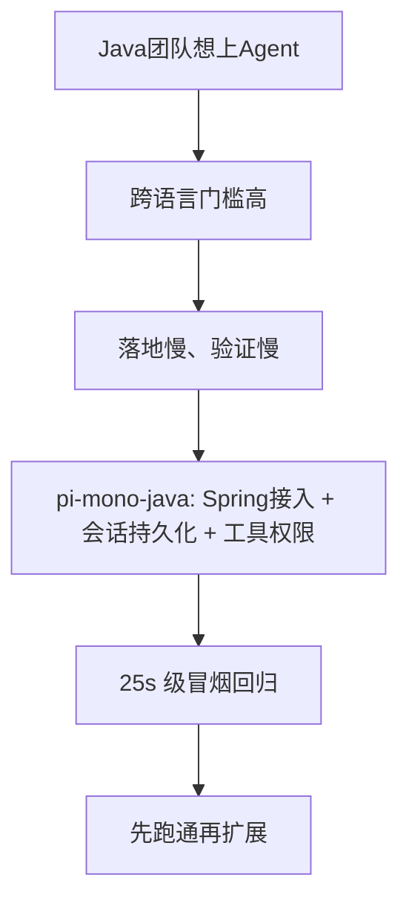

# 用 Java 做 Agent，为什么总是“差最后一公里”？

> 适合发布平台：小红书（技术向、克制表达）

## 真实痛点

我见过最常见的 3 个卡点：

1. 业务是 Java/Spring，但参考实现几乎都在 TS。
2. 看懂原理后，落地到 Spring 注入、配置、会话持久化依然要重写一遍。
3. 缺少“可快速验证”的闭环，改一行不敢发。

## 我们做了什么（不夸大）

`pi-mono-java` 不是要替代 TS 生态，而是做一个 Java 团队可直接使用的起步底座：

- `pi-starter`：Spring Boot 低摩擦接入
- `pi-session`：会话树 + JSONL 持久化
- `pi-tools`：`read/write/edit/bash/find/grep/ls`
- `pi-cli`：本地交互验证
- `scripts/benchmark_smoke.sh`：统一冒烟回归入口

## 数据说话（2026-03-21 本地样例）

| 检查项 | 结果 | 耗时 |
|---|---|---:|
| Compile | PASS | 2s |
| Session Unit Test | PASS | 2s |
| Spring Example Tests | PASS | 19s |
| CLI Smoke | PASS | 2s |

另外：仓库当前 `@Test` 方法约 **17 个**，覆盖了核心主链路。

## 和 TS 版 pi-mono 对齐了吗？

一句话：**核心链路部分对齐，生态层未对齐。**

- 对齐较好：核心抽象、会话持久化、Spring 可接入
- 部分对齐：工具运行时、CLI 工作流
- 未对齐：Web/TUI 体验层、Slack bot、pods 等生态能力

## 一张图看价值

## 截图占位（发布前补）

- [截图1占位] `benchmark-latest.md` 的 PASS 表格
- [截图2占位] Spring 示例 “所有Spring集成测试通过！”
- [截图3占位] CLI `help` 与会话创建

## 适合谁

- Java/Spring 团队要快速验证 Agent 主链路
- 自研 Agent 框架团队想找“轻量参考实现”
- 不想一上来就重投 TS 生态的人

## 最后一句（克制版）

它不是银弹，但能帮你把“最后一公里”先变成“可跑、可测、可迭代”。

